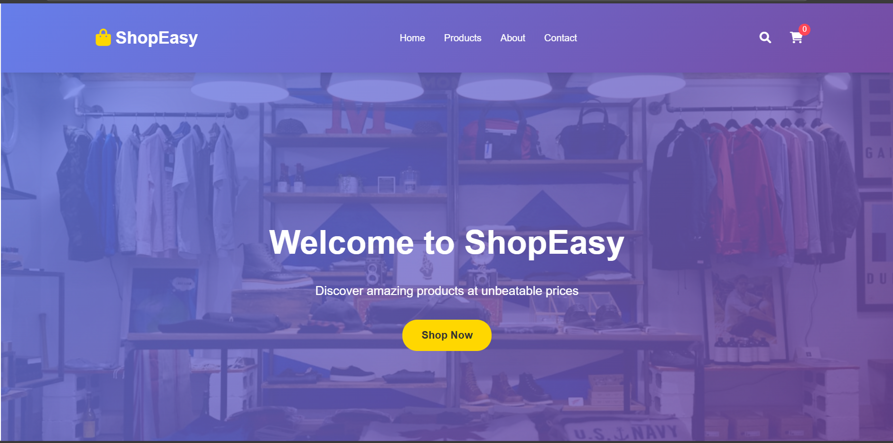

# 🛒 ShopEasy - E-commerce Website

A responsive and dynamic e-commerce website built using **HTML, CSS, and JavaScript**, allowing users to browse products, search, filter by category, add items to a cart, and manage orders — all in a sleek and user-friendly interface.

## 🚀 Live Demo

👉 [View Website on Vercel]  

---

## 📁 Features

- 🖼️ Real product images with responsive layout
- 🔍 Product filtering by category and live search
- 🛒 Add to cart, quantity update, and cart total
- 📦 Cart persistence using `localStorage`
- 💻 Responsive design for desktop, tablet, and mobile
- 📬 Contact and Newsletter subscription forms (simulated)

---

## 🧰 Tech Stack

- **HTML5** – Markup structure
- **CSS3** – Styling with animations and responsive layout
- **JavaScript (Vanilla)** – Interactivity and product logic
- **Vercel** – Hosting and deployment

---

## 📸 Screenshots




---

## 🗂️ Project Structure

my-ecommerce-project/
├── index.html
├── styles.css
├── script.js
├── headphones.jpeg
├── laptop.jpeg
├── jeans.jpeg
├── book.jpeg
├── kitchen-appliance.jpeg
└── README.md

yaml
Copy
Edit

---

## 💡 How to Use

1. **Clone the repository:**
   ```bash
   git clone https://github.com/yourusername/ecommerce-site.git
   cd ecommerce-site
Run locally:

Just open index.html in your browser.

Deploy on Vercel (Optional):

Connect the repo to https://vercel.com and deploy directly.

🤝 Contributing
Pull requests are welcome! If you have suggestions or improvements, feel free to fork and submit a PR.

📄 License
This project is open-source and free to use for educational purposes.
